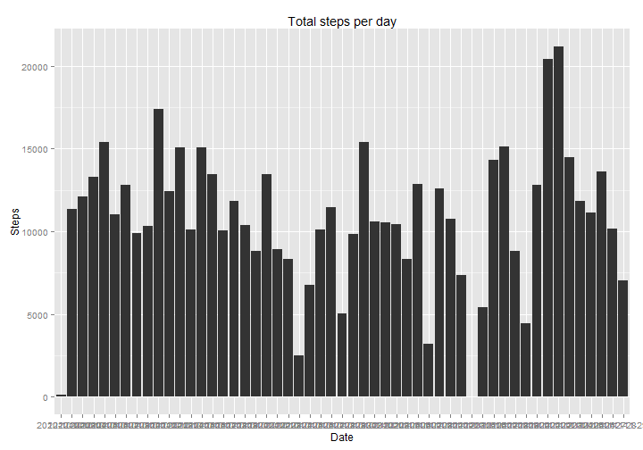
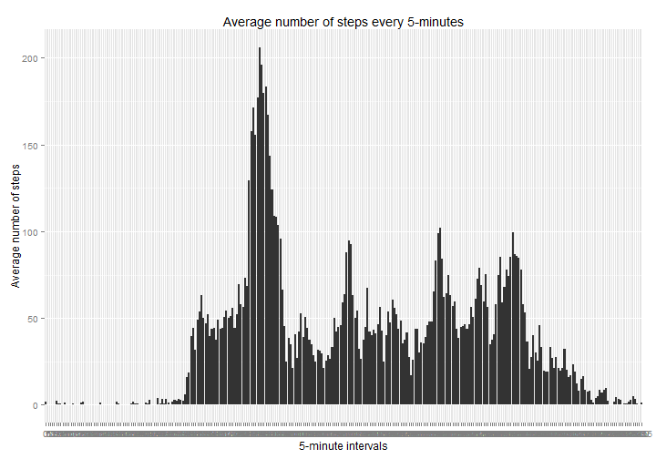

# Reproducible Research: Peer Assessment 1


## Loading and preprocessing the data
This is time for reading the csv data, separated by comas

```r
data<-read.csv("activity.csv", sep=",")
```
We preprocess the data, takking steps and interval as numbers


```r
data$steps<-as.numeric(data$steps)
data$interval<-as.numeric(data$interval)
```
## What is mean total number of steps taken per day?
First, we aggregate the data by date to take the sum of steps


```r
aggregatedData<-aggregate(. ~ date, data, sum)[1:2]
```

We make a histogram of the total number of steps taken each day


```r
library(ggplot2)
g<-ggplot(aggregatedData, aes(date,steps))
g + geom_bar(stat="identity") +
   labs(title = "Total steps per day") +
   labs(x = "Date", y = "Steps") 
```

 


and calculate the median and the mean of all the days


```r
median(aggregatedData$steps)
```

```
## [1] 10765
```

```r
mean(aggregatedData$steps)
```

```
## [1] 10766
```


## What is the average daily activity pattern?

We Make a time series plot of the 5-minute interval (x-axis) and the average number of steps taken, averaged across all days (y-axis)

Firt, we take the data aggregated by 5-minute intervals

```r
dataIntervalAggregated<-data
dataIntervalAggregated$interval<-factor(dataIntervalAggregated$interval)
aggregatedIntervalData<-aggregate(. ~ interval, dataIntervalAggregated, mean)[1:2]
```

We plot the results

```r
library(ggplot2)
g<-ggplot(aggregatedIntervalData, aes(interval,steps))
g + geom_bar(stat="identity") +
   labs(title = "Average number of steps every 5-minutes") +
   labs(x = "5-minute intervals", y = "Average number of steps") 
```

```
## Warning: position_stack requires constant width: output may be incorrect
```

 

Which 5-minute interval, on average across all the days in the dataset, contains the maximum number of steps?


```r
aggregatedIntervalData[aggregatedIntervalData$steps==max(aggregatedIntervalData$steps),]
```

```
##     interval steps
## 104      835 206.2
```


## Imputing missing values


## Are there differences in activity patterns between weekdays and weekends?
